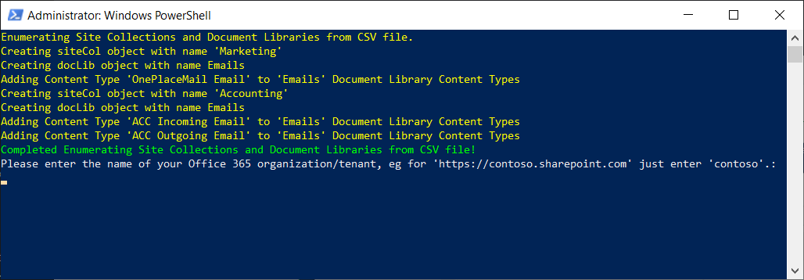
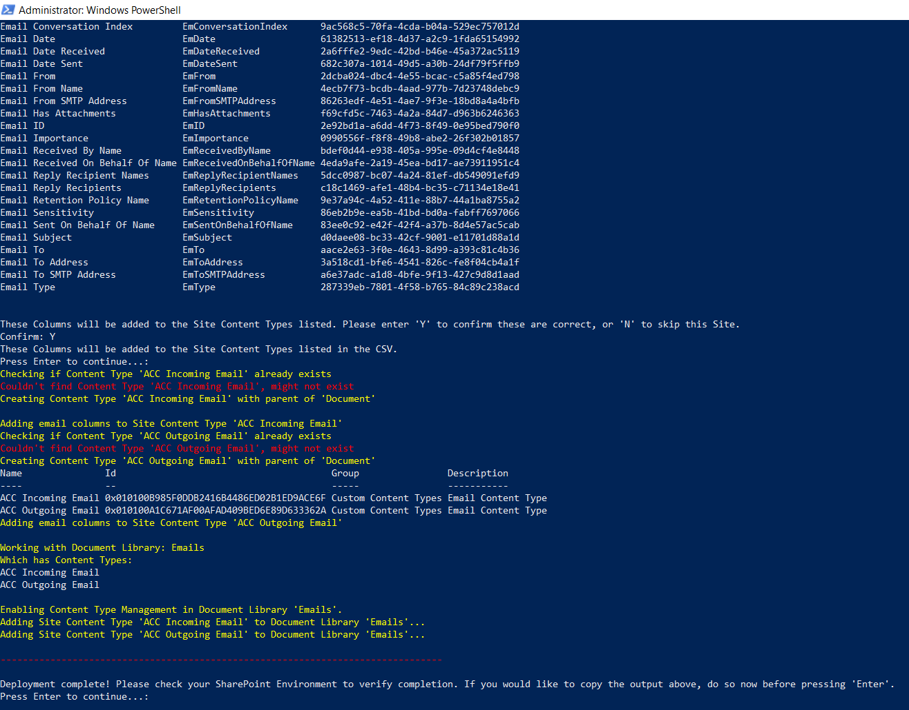

# ContentTypeDeploymentPnP ReadMe

A script and sample CSV file to create the OnePlace Solutions Email Columns, add them to Content Types in listed Site Collections, create the named Content Type(s) where necessary, add them to listed Document Libraries, and create a default Email view.

## Table of Contents

1. [Getting Started](#getting-started)\
    1a. [Pre-Requisites](#pre-requisites)\
    1b. [Assumptions and Considerations](#assumptions-and-considerations)\
    1c. [Restrictions](#restrictions)
2. [SharePoint Online](#sharepoint-online)
3. [SharePoint On-Premise](#sharepoint-on-premise)
4. [License](#license)
5. [Acknowledgments](#acknowledgments)

## Getting Started

Please read the entire README (this page) before using the script to ensure you understand it's prerequisites and considerations/limitations.

Download the 'SitesDocLibs.csv' file ([Right Click this link](https://github.com/OnePlaceSolutions/ContentTypeDeploymentPnP/raw/master/SitesDocLibs.csv) and select 'Save target as' or 'Save link as'), and ensure you save it as a .CSV file. Customize it to your requirements per the notes below, you will be prompted for this file by the script.
If the sample data appears to be in one column in Excel, please try importing the CSV file into Excel via the Data tab instead of opening it directly.
If the script fails to import the contents of the CSV file, please check the CSV file in Notepad to check that the columns appear similar to [this](./SitesDocLibs.csv) and the delimiter is still a comma ','. European formatting in Excel may cause this issue, in which case customize the CSV file in Notepad.

Notes regarding the CSV file:
* The SitesDocLibs.CSV file already contains an example deployment for the 'Contoso' Tenant. If run, it would deploy the Email Content Type 'OnePlaceMail Email' to the 'Emails' Document Library in the 'Marketing' Site Collection, and two Email Content Types to the 'Emails' Document Library in the 'Accounting' Site Collection; 'ACC Incoming Email' and 'ACC Outgoing Email'. If these Content Types do not exist, the script would create them.
* You need a new line for each uniquely named Site Content Type, define which Site Collection it will be created in, and (optionally) which Document Library it will be added to. 
* When listing a subsite/subweb for the 'SiteUrl', the content type will be created in it's parent Site Collection, eg http./<span>contoso.sharepoint.com/sites/**SiteCollection**/SubSite. You can still list a Document Library within that Subsite to have the Site Content Type added to.
* You may use this script for purely Site Column/Content Type creation by omitting any data for the Document Library column.
* Any Site Content Types listed in the CSV that already exist in your SharePoint Environment will have the Email Columns added to it (and preserve the existing columns).

When you have finished customizing the file, please save and close it to ensure the script can correctly read it.

### Pre-Requisites

1.  Administrator rights to your SharePoint Admin Site (for SharePoint Online) and the Site Collections you wish to deploy to.
2.  **(SharePoint On-Premise Only)** [The SharePoint PnP PowerShell cmdlets](https://github.com/pnp/PnP-PowerShell). 
    You will need to install **only the the cmdlets that target your version of SharePoint** on the machine you are running the script from. If you have installed the cmdlets previously using an MSI file these need to be uninstalled from Control Panel, but if you have installed the cmdlets previously using PowerShell Get you can update them with this command:
    ```
    Update-Module SharePointPnPPowerShell<version>
    ```
    
    This is the command pictured to install the PnP Cmdlets via PowerShell Get:
    ```
    Install-Module SharePointPnPPowerShell<version>
    ```
    > 
	
3.  **(SharePoint Online Only)** (Multi-Tenant supported) [The latest PnP.PowerShell](https://pnp.github.io/powershell/articles/installation.html) installed on the machine you are running the script from. You can run the below command in PowerShell (as Administrator) to install it. 

    Install new PnP.PowerShell Cmdlets:
    ```
    Install-Module -Name "PnP.PowerShell"
    ```
    Note that you will need to ensure you have uninstalled any previous 'Classic' PnP Cmdlets prior to installing this. If you have installed the cmdlets previously using an MSI file these need to be uninstalled from Control Panel, but if you have installed the cmdlets previously using PowerShell Get you can uninstall them with this command (as Administrator):

    ```
    Uninstall-Module 'SharePointPnPPowerShellOnline'
    ```
    
    This script will also require your Microsoft 365 Administrator to grant App access to the PnP Management Shell in your 365 Tenant. It is recommended that you check and grant this ahead of running the script by entering this command in PowerShell and following the directions. Documentation and more information [here](https./pnp.github.io/powershell/articles/authentication.html).
    ```
    Register-PnPManagementShellAccess
    ```
    > 
    
    * We recommend only granting this App access for your account, and if you no longer require this access after running the script you can delete it from your Microsoft 365 Tenant which will revoke it's permissions. [Microsoft Documentation on Deleting Enterprise Applications](https./docs.microsoft.com/en-us/azure/active-directory/manage-apps/delete-application-portal).
    * The PnP Management Shell is created by the PnP project to facilitate authentication and access control to your 365 Tenant, and is not published by OnePlace Solutions. Granting permissions for the PnP Management shell to a user/users only allows **delegated access**, the user must still authenticate and have the adequate permissions to perform any actions through the PnP Management Shell. In previous versions of the PnP Cmdlets these permissions did not need to be requested, but with the move to Modern Authentication these permissions are now explicitly requested.
    * This script (ContentTypeDeploymentPnP) only utilizes the PnP.PowerShell commands requiring the 'Have full control of all Site Collections' permission pictured above, and this is restricted by the delegated permissions of the user that is authenticating. 

### Assumptions and Considerations

* Content Type(s) to be created will have the Site Content Type 'Document' for it's Parent Content Type. 
* Column group name supplied to the script (when prompted) will have all it's columns added to the Content Type(s). If your current Email Columns exist in a group with other columns, please add them to a new Column group to use with this script
* When using this script to add the Email Columns to an existing Content Type, this existing Content Type must be a Site Content Type, and it may be updated to inherit from the 'Document' Site Content Type in the process.
* [OnePlace Solutions Email Columns](https./github.com/OnePlaceSolutions/EmailColumnsPnP) have been installed to the Site Collections you wish to deploy to. This can be done in this script when prompted if not already installed.

### Restrictions

* Only works for SharePoint Online or 2016/2019 environments. SharePoint 2013 is not supported with this script.
* Only works with Site Content Types (for both creation and adding Email Columns to existing) inheriting from the 'Document' Site Content Type. These Site Content Types can however still be added to locations within subsites/subwebs.

## SharePoint Online

1. Download the CSV file and modify it to suit your deployment requirements. 

   

2. Start PowerShell (as Administrator) on your machine:
   
   
3. Run the below command to invoke the current(master) version of the script:

   ```
   Invoke-Expression (New-Object Net.WebClient).DownloadString(‘https://raw.githubusercontent.com/OnePlaceSolutions/ContentTypeDeploymentPnP/master/DeployECTToSitesDoclibs-SPO.ps1’)
   ```
   

4. Modify your options as required
	
	
	
	1. Select CSV file. Path:
		Select this option to specify the CSV file you are using to deploy
	2. Enable Email Column Creation: True
		Select this option to disable/enable automatic Email Column creation. Default value is 'True'.
	3: Email Column Group: OnePlace Solutions
		This is the name of the Column Group we expect to find the Email Columns when creating Content Types. If you have left 2 as 'True' this can be left as is.
	4: Enable Email View Creation: False
		Select this option to enable/disable automatic Email View creation in the Document Libraries you specified in the CSV file. Default value is 'False'.
	5: Email View Name: Emails
		This is the name of the View the script will create if you changed 4. to 'True'.
	6: Set View 'Emails' as default: False
		If you have changed 4. to 'True', select this option to enable/disable setting that view as Default in the locations it is created. Default value is 'False'
	7: Deploy
		Once you have changed the other options as required, select this option to begin executing the script.

## SharePoint On-Premise

1. Download the CSV file and modify it to suit your deployment requirements. 

   

2. Start PowerShell (as Administrator) on your machine:
   

3. Run the below command to invoke the current(master) version of the script:

   ```
   Invoke-Expression (New-Object Net.WebClient).DownloadString(‘https://raw.githubusercontent.com/OnePlaceSolutions/ContentTypeDeploymentPnP/master/DeployECTToSitesDoclibs-ONP.ps1’)
   ```
   

4. Select your SharePoint Environment, 1 for SharePoint Online/365, or 2 for SharePoint 2016/2019 On-Premises
   
   
5. Enter the name of your Office 365 Tenant to authenticate against the SharePoint Administration Site using the SharePoint Online Management Shell. This is required to iterate across the Site Collections you have listed in the CSV file. For On-Premises, this step will prompt you for your Root Site Collection instead. You can also see above how the script has parsed the CSV file.
   

6. If you would like to automatically create the OnePlaceMail Email Columns in the Site Collections listed in the CSV, you can opt to do so now. Both options will prompt you for the Column Group Name that contains (or will contain) the OnePlaceMail Email Columns. Default name is 'OnePlace Solutions'
   

7. If you would like to automatically create a default Email View in the Document Libraries listed in the CSV, you can also opt to do so now. This will create a default view with the email columns: 'EmDate', 'Name','EmTo', 'EmFrom', 'EmSubject'. Default name is 'OnePlaceMail Emails'.
  

8. Once the email columns have been created or found in your Site Collection(s), you will be prompted to confirm these are the columns you intend to add to the Site Content Types listed in the CSV (and by extension your Document Libraries listed). Type 'Y' and press Enter to continue if they are correct. The pictured example contains all the OnePlaceSolutions Email Columns.
  

9. The script will now add (and create if opted for) the Email Columns to the Email Content Types listed in the CSV, and add those Email Content Types to the Document Libraries listed in the CSV. If you opted for a default Email View to be created, it will also be done now. In this example the script has created the two Content Types listed in the sample CSV, added the Email Columns, and then added those Content Types to the Document Library listed in the sample CSV
  

## License

This project is licensed under the MIT License - see the [LICENSE.md](LICENSE.md) file for details

## Acknowledgments

* Colin Wood for his code example on CSV parsing/iterating, and the original Email Columns deployment script.
