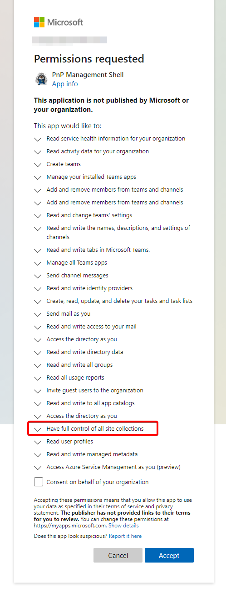
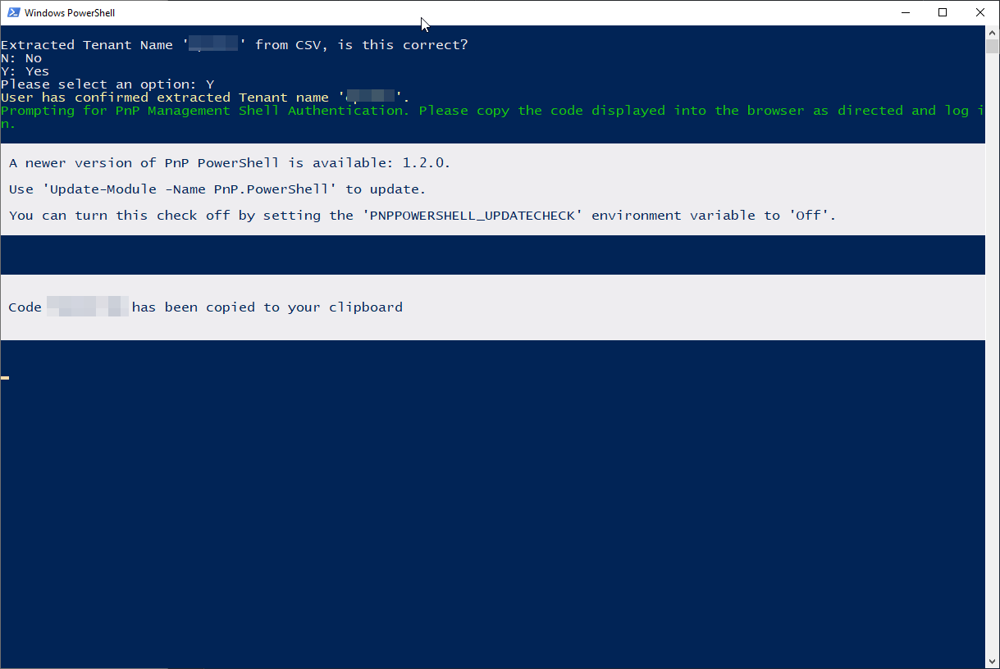

# ContentTypeDeploymentPnP ReadMe

A script and sample CSV file to create the OnePlace Solutions Email Columns, add them to Content Types in listed Site Collections, create the named Content Type(s) where necessary, add them to listed Document Libraries, and create a default Email view.

## Table of Contents

1. [Getting Started](#getting-started)\
    1a. [Pre-Requisites](#pre-requisites)\
    1b. [Assumptions and Considerations](#assumptions-and-considerations)
2. [SharePoint Online](#sharepoint-online)
3. [License](#license)
4. [Acknowledgments](#acknowledgments)

## Getting Started

Please read the entire README (this page) before using the script to ensure you understand it's prerequisites and considerations/limitations.

Download the 'SitesDocLibs.csv' file ([Right Click this link](https://github.com/OnePlaceSolutions/ContentTypeDeploymentPnP/raw/master/SitesDocLibs.csv) and select 'Save target as' or 'Save link as'), and ensure you save it as a .CSV file. Customize it to your requirements per the notes below, you will be prompted for this file by the script.
If the sample data appears to be in one column in Excel, please try importing the CSV file into Excel via the Data tab instead of opening it directly.
If the script fails to import the contents of the CSV file, please check the CSV file in Notepad to check that the columns appear similar to [this](./SitesDocLibs.csv) and the delimiter is still a comma ','. European formatting in Excel may cause this issue, in which case customize the CSV file in Notepad.

Notes regarding the CSV file:
* The SitesDocLibs.CSV file already contains an example deployment for the 'Contoso' Tenant. If run, it would deploy the Email Content Type 'OnePlaceMail Email' to the 'Emails' Document Library in the 'Marketing' Site Collection, and two Email Content Types to the 'Emails' Document Library in the 'Accounting' Site Collection; 'ACC Incoming Email' and 'ACC Outgoing Email'. If these Content Types do not exist, the script would create them.
* You need a new line for each uniquely named Site Content Type, define which Site Collection it will be created in, and (optionally) which Document Library it will be added to. 
* When listing a subsite/subweb for the 'SiteUrl', the content type will be created in it's parent Site Collection, eg http./<span>contoso.sharepoint.com/sites/**SiteCollection**/SubSite. You can still list a Document Library within that Subsite to have the Site Content Type added to.
* You may use this script for purely Site Column/Content Type creation by omitting any data for the Document Library column.
* Any Site Content Types listed in the CSV that already exist in your SharePoint Environment will have the Email Columns added to it (and preserve the existing columns).
* Built-in Document Libraries must be named as you see them in your user language, eg if the Site is in Norwegian the 'Documents' library is called 'Dokumenter', if your profile is set to English you will see this in the browser as 'Documents' and must use 'Documents' in this script. If your user profile language aligns to the SharePoint Site language then use what is present in SharePoint.

When you have finished customizing the file, please save and close it to ensure the script can correctly read it.

### Pre-Requisites

1.  Administrator rights to your SharePoint Admin Site (for SharePoint Online) and the Site Collections you wish to deploy to.
2.  **(SharePoint Online Only)** (Multi-Tenant supported) [The latest PnP.PowerShell](https://pnp.github.io/powershell/articles/installation.html) installed on the machine you are running the script from. You can run the below command in PowerShell (as Administrator) to install it. 

    Install new PnP.PowerShell Cmdlets:
    ```
    Install-Module -Name "PnP.PowerShell"
    ```
    Note that you will need to ensure you have uninstalled any previous 'Classic' PnP Cmdlets prior to installing this. If you have installed the cmdlets previously using an MSI file these need to be uninstalled from Control Panel, but if you have installed the cmdlets previously using PowerShell Get you can uninstall them with this command (as Administrator):

    ```
    Uninstall-Module 'SharePointPnPPowerShellOnline' -Force
    ```
    
    This script will also require your Microsoft 365 Administrator to grant App access to the PnP Management Shell in your 365 Tenant. It is recommended that you check and grant this ahead of running the script by entering this command in PowerShell and following the directions. PnP.PowerShell Documentation and more information [here](https./pnp.github.io/powershell/articles/authentication.html).
    ```
    Register-PnPManagementShellAccess
    ```
    > 
    
    * We recommend only granting this App access for your account, and if you no longer require this access after running the script you can delete it from your Microsoft 365 Tenant which will revoke it's permissions. [Microsoft Documentation on Deleting Enterprise Applications](https./docs.microsoft.com/en-us/azure/active-directory/manage-apps/delete-application-portal).
    * The PnP Management Shell is created by the PnP project to facilitate authentication and access control to your 365 Tenant, and is not published by OnePlace Solutions. Granting permissions for the PnP Management shell to a user/users only allows **delegated access** (Microsoft Graph documentation on permissions [here](https://docs.microsoft.com/en-us/graph/auth/auth-concepts#microsoft-graph-permissions)), the user must still authenticate and have the adequate permissions to perform any actions through the PnP Management Shell. In previous versions of the PnP Cmdlets these permissions did not need to be requested, but with the move to Modern Authentication these permissions are now explicitly requested.
    * This script (ContentTypeDeploymentPnP) only utilizes the PnP.PowerShell commands requiring the 'Have full control of all Site Collections' permission pictured above, and this is restricted by the delegated permissions of the user that is authenticating. 

### Technical Assumptions and Considerations

* Content Type(s) to be created will have the Site Content Type 'Document' for it's Parent Content Type. 
* Column group name supplied to the script (when prompted) will have all it's columns added to the Content Type(s). If your current Email Columns exist in a group with other columns, please add them to a new Column group to use with this script
* When using this script to add the Email Columns to an existing Content Type, this existing Content Type must be a Site Content Type, and it may be updated to inherit from the 'Document' Site Content Type in the process.
* Only works with Site Content Types (for both creation and adding Email Columns to existing) inheriting from the 'Document' Site Content Type. These Site Content Types can however still be added to locations within subsites/subwebs.

## SharePoint Online

1. Download the CSV file and modify it to suit your deployment requirements. 

   

2. Start PowerShell (as Administrator) on your machine:
   
   
3. Run the below command to invoke the current(master) version of the script:

   ```
   Invoke-Expression (New-Object Net.WebClient).DownloadString(‘https://raw.githubusercontent.com/OnePlaceSolutions/ContentTypeDeploymentPnP/master/SharePoint%20Online/DeployECTToSitesDoclibs-SPO.ps1’)
   ```
   

4. Modify your options as required
    
    
    
    1\. Select CSV file. Path:
    > Select this option to specify the CSV file you are using to deploy. Once selected, you will also see an output of how the script parsed your CSV file.
    
    2\. Enable Email Column Creation: True
    > Select this option to disable/enable automatic Email Column creation. Default value is 'True'.
    
    3\: Email Column Group: OnePlace Solutions
    > This is the name of the Column Group we expect to find the Email Columns when creating Content Types. If you have left 2 as 'True' this can be left as is. Default value is 'OnePlace Solutions'
    
    4\: Enable Email View Creation: False
    > Select this option to enable/disable automatic Email View creation in the Document Libraries you specified in the CSV file. Default value is 'False'.
    
    5\: Email View Name: Emails
    > This is the name of the View the script will create if you changed 4. to 'True'. Default value is 'Emails'
    
    6\: Set View 'Emails' as default: False
    > If you have changed 4. to 'True', select this option to enable/disable setting that view as Default in the locations it is created. Default value is 'False'
    
    7\: Deploy
    > Once you have changed the other options as required, select this option to begin executing the script.
    
    L\: Change Log file path (Currently: 'C:\Users\<username>\Documents\OPSScriptLog.txt')
    > You can opt to log the script actions to a different path. Default value is in the current User's profile under 'Documents\OPSScriptLog<date>.txt'.
    
5.  The script will automatically parse your Microsoft 365 Tenant name from the CSV file, please confirm this is correct and continue.]
    

6.  You will be asked to authenticate to your SharePoint Admin Site through the PnP Management Shell. Please follow the directions from the script, and if required consent to the PnP Management Shell. You may be prompted immediately for a login rather than see the screen pictured below.
    


## License

This project is licensed under the MIT License - see the [LICENSE.md](LICENSE.md) file for details

## Acknowledgments

* Colin Wood for his code example on CSV parsing/iterating, and the original Email Columns deployment script.
